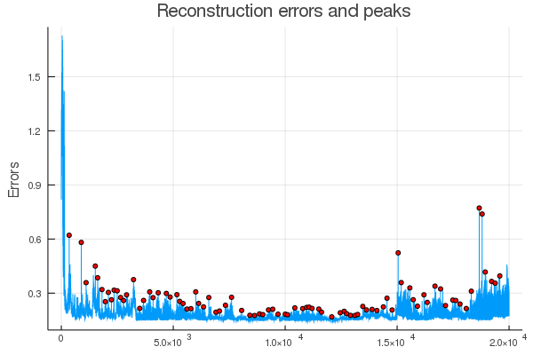

A package for detecting weird stuff in long acoustic recordings using a sparse autoencoder on raw audio data.
# Installation
This package requires a working Julia GPU environment. Follow instructions at [CuArrays.jl](https://github.com/JuliaGPU/CuArrays.jl/)

After that, install this package like this:
```julia
cd(@__DIR__)
using Pkg
Pkg.add("https://github.com/baggepinnen/DiskDataProviders.jl")
Pkg.add("https://github.com/baggepinnen/Detector.jl")
cd("path/to/this/repo")
Pkg.instantiate()
using Detector
```

# Usage examples


## Preprocess data

All functionality in this package operates on serialized, preprocessed data files. Serialized files are much faster to read than wav, and storing already preprocessed data cuts down on overhead. To create preprocessed files, we use any of the following

```julia
using Detector, LazyWAVFiles
readpath = "path/to/folder/with/wavfiles"
savepath = "path/to/store/files"
readpath = "/media/fredrikb/storage/crocs/20190821/"
savepath = "/home/fredrikb/arl/crocs_processed/"
df       = DistributedWAVFile(readpath)
second   = 48000
serializeall_raw(savepath, df; segmentlength = 1second)    # Serializes raw audio waveforms, for autoencoding
```

## Create a dataset
For further help using [DiskDataProviders](https://github.com/baggepinnen/DiskDataProviders.jl), see its [documentation]((https://baggepinnen.github.io/DiskDataProviders.jl/latest))
```julia
using DiskDataProviders, MLDataUtils, Flux

function str_by(s)
    m = match(r"(\d+)_(\d+) secon", s)
    parse(Int, m.captures[1])*1000000 + parse(Int, m.captures[2])
end
files = sort(savepath.*mapfiles(identity, savepath, ".bin"), by=str_by)

transform(x) = Flux.normalise(sqrt.(abs.(Float32.(x))).*sign.(x), dims=1) # Some transformation you may want to do on the data
dataset = ChannelDiskDataProvider{Vector{Float32}, Nothing}((1second,), 12, 120, files=files, transform=transform)

t   = start_reading(dataset) # This will start the bufering of the dataset
istaskstarted(t) && !istaskfailed(t) && wait(dataset)
bw  = batchview(dataset) # This can now be used as a normal batchview
x,y = first(bw)
```

## Train the detector
```julia
using Flux, BSON
model = Detector.model
sparsify = true
Detector.encode(model,x, sparsify=sparsify) # This will give you the latent channels of x
Detector.train(model, batchview(dataset), epochs=5, sparsify=sparsify) # Perform one epoch of training. This will take a long time, a figure will be displayed every now and then. This command can be executed several times
# bson("detector.bson", model=cpu(model)) # Run this if you want to save your trained model
```

To fine tune the detector, you may run a small number of epochs on a particular dataset of interest. Just make sure you apply the same input transformation to this dataset as you did for the training dataset, example:
```julia
sound         = load_your_new_sound()
newdataset    = Vector.(Iterators.partition(sound, 3second))[1:end-1] # remove the last datapoint as this is probably shorter
model         = Detector.load_model()
tunedataset   = dataset.transform.(newdataset)
losses        = Detector.train(model, shuffle(tunedataset), epochs=1)
```

## Detection using reconstruction errors
```julia
using Peaks
model  = Detector.load_model() # Load pre-trained model from disk
errors = reconstruction_errors(model, dataset, sparsify=sparsify) # This will take a couple of minutes if done on a large dataset (about half the time of a training epoch)
m,proms = peakprom(errors, Maxima(),1000) # Find peaks in signal
plot(errors);scatter!(m,errors[m], m=(:red, 3), ylabel="Errors", legend=false)
save_interesting(dataset, m, contextwindow=1) # This will save the interesting clips to a folder on disk
```


The call to `save_interesting` will save all interesting files to disk in wav format for you to listen to. The file paths are printed to `stdout`. A file with all the clips concatenated will also be saved. The `contextwindow` parameter determine how many clips before and after an interesting clip will be saved.

## Detection using feature activations
The idea here is to look at the features that ar least activated. When thos features are activated, it means there is something rare in the signal. I did not get great results with this method, it tended to only pick events of one particular type, in my case, a snapping insect.
```julia
using Peaks
F = feature_activations(model, dataset, sparsify=sparsify)
acts = mean(abs, F, dims=2)[:]
least_activated_featureinds = sortperm(acts)
least_activated_features = F[least_activated_featureinds[1:8], :]
interesting = map(eachrow(least_activated_features)) do feature
    m,proms = peakprom(feature, Maxima(),1000) # Find peaks in signal
    m[sortperm(proms, rev=true)[1:20]]
end
interesting = unique(reduce(vcat, interesting))
save_interesting(dataset, interesting)
```
